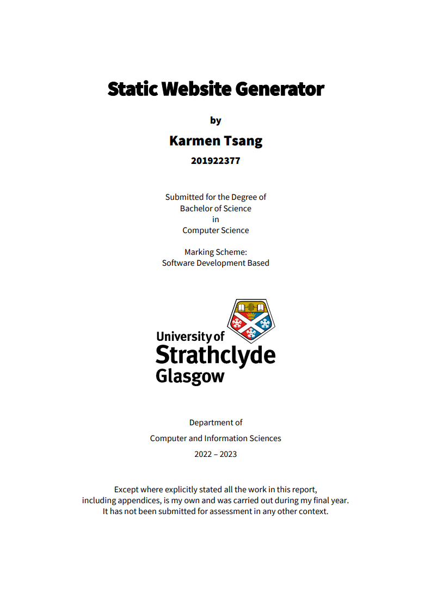

For my honors project, I undertook the development of my own static site generator (SSG) 
using Python. Drawing upon my prior experience in web development during high school and 
university, I felt confident in my ability to build a generator from the ground up. 
The objective was to design a versatile tool capable of generating static websites 
from different formats such as Markdown, YAML, HTML, and CSS. Additionally, I incorporated 
dynamic features into the SSG and ensured its user-friendliness.

I realised an opportunity to utilise my skills and knowledge to create a website 
that would not only showcase my progression but also serve as a digital portfolio. 
I aim to demonstrate my growth, skills, and dedication to potential employers and collaborators, 
providing them with a comprehensive insight into my capabilities and achievements.

Here is the front cover of my dissertation.

